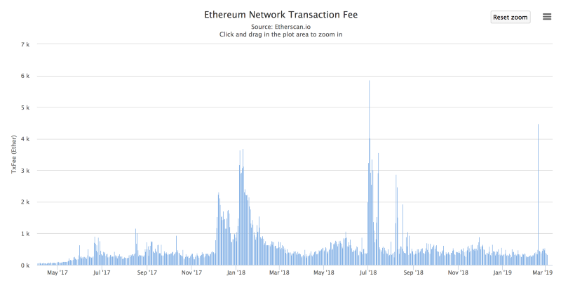
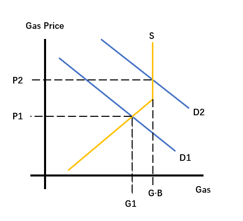
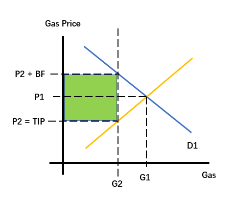
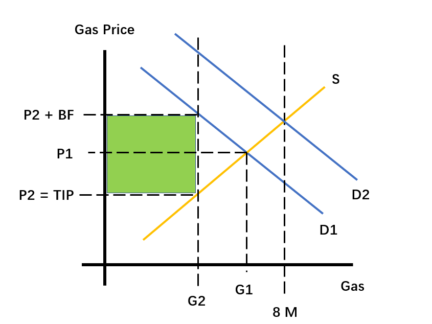
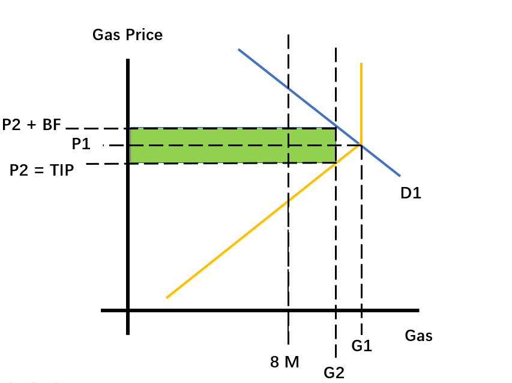

## 一. 前言

我一向知道，有一群人，经常自称“经济学家”，然而他们的日常工作却不是研究经济学理论，对经济制度的运行原理也一无所知。他们最常干的事情就是对着一堆表格和折线图（或者是饼图，随便了）大放厥词：“你看，这个峰，它好高哦！这不合理！” “你看，这个增长率，居然不是 6.18，它不美，它一定有问题！” 然后就开始装模做样地提出各种不着调的所谓“建议”。

我希望在本文中论证的是，Eric Conner 正是这样一种只会罗列数字的“经济学家”，而 EIP-1559 也正是这样一种不成熟的建议；Eric 对自己所提 EIP 的实质一无所知，在他的文章中我连经济学的影子都没有看到。

Eric Conner 在 Medium 上发表的解释 EIP-1559 的文章在此：[<1>](https://medium.com/@eric.conner/fixing-the-ethereum-fee-market-eip-1559-9109f1c1814b)；Unitime 提供的中译本在此：[<2>](https://mp.weixin.qq.com/s?__biz=MzU2MDE2MDU3Mg==&mid=2247490369&idx=1&sn=7b8fc29d28f280c61cbfd141bfb06ef1&chksm=fc0d1112cb7a9804ba4aca45937749249ad3eec6471c784c682e218a7122b75fc3fb73014206&scene=0&xtrack=1&key=eeca034c219d0a571f81786cf296b6dc25c46da189733244103f42e18ae1ef57984b03b067f15ebd9cd31c10d8aaf9e98b97016ccc6539ce169456504aa375cc7f70496421993b1f6dcab53727961064&ascene=1&uin=Mjc4MjA1NTcyNA%3D%3D&devicetype=Windows+10&version=62060728&lang=zh_CN&pass_ticket=pYEKfrMkmqOcF0GSjqU%2FC6jXgHE93dNtFrBLEYvkL2sL2unIvs%2Fegpn9YrOVaf%2Bi)。

上图为 Eric 在文章开头附上的一张柱状图，截取自 Etherscan 网站，反映了以太坊交易手续费的历史数据。**依据这张图**，Eric 说以太坊上的交易手续费是不稳定的，很多人反映难以估计最优手续费、pending 时长比预期要长，因此他要设计一种手续费制度，让人们（1）可以预测手续费；（2）尽可能少交手续费。

接下来，我将先归纳 EIP-1559 的内容，然后提供经济学分析，最后，我希望证明 EIP-1559 实际上并不能实现 Eric 提出的目标，反而会给系统引入不必要的属性。

## 二. EIP-1559 简介

EIP-1559 主要由三个部分组成：

1. 将区块 Gas 上限由 800 万调整到 1600 万；
2. 给每个区块都设定 BASEFEE（字面意义为“基本手续费”），在同一区块中打包的交易都以 BASEFEE 作为 Gas Price；并且，BASEFEE 会根据此前区块的 GAS 利用率动态调整，如果利用率低于 50%，则降低手续费，如果利用率高于 50%，则提高手续费；然而，这些手续费并不会交给矿工，而是会被协议销毁掉（burn）；
3. 除了由 BASEFEE 确定的手续费以外，用户还可以自定义给矿工的小费（tip）。

据 Eric 解释，把手续费燃烧掉是为了防止矿工通过发交易来操控 BASEFEE。

如果没有“燃烧手续费”这一条，整个 EIP 看起来会像一个**限价政策**，而小费是限价政策的补充措施——就像滴滴或者 Uber 一样，以公里计的里程费是由系统给出的，司机不能讨价，但滴滴也要给你一个给司机小费的功能，防止实在没有司机接单的时候乘客无计可施。

上面这种情形能不能实现 Eric 所说的目标我就不赘述了，但加入“燃烧手续费”这一条，却使整个 EIP 大幅改变，变成了一种**税收措施**。听我细细道来。

## 三. EIP-1599 的经济学分析

### （一）当前市场中手续费之决定

上图反映了在当前的手续费制度下，Gas 价格是如何决定的。

纵轴表示每单位 Gas 的价格，横轴表示 Gas 的数量。蓝色的线为以太坊用户的需求曲线，表示在相应数量下用户愿意为一单位的 Gas 支付的最高价格，需求曲线斜向下是因为用户会把最紧迫的需要排在前面，因此每额外的一单位 Gas 给用户带来的好处都是递减的，用户因此越来越不愿意付钱。而橙色的线则是以太坊矿工的 Gas 供给曲线，表示矿工（矿池）在打包交易时，在特定数量上为一单位的 Gas 要求的最低价格，因为提供 Gas 需要运算，而为额外的一单位 Gas 付出的计算量是逐步上升的，因此矿工要求的价格也会逐渐上升；而供给曲线右边会有一个垂直的阶段，这是因为在一定时间内，Gas 供给的最大数量是被协议限定的，超过这个数量，矿工就算想提供，协议也不允许，所以在该阶段，Gas 的价格再高矿工也无法打包更多交易（矿工的最大处理能力一定大于区块的 Gas 上限，因为处理能力小于此上限的矿工会被淘汰掉）。

上图显示了在**一定时间**内（比如 30 秒内或者 10 分钟内），以太坊网络的供给和需求状况。如果需求曲线是 D1，则区块的 Gas 用量是 G1，而 Gas 的价格是 P1；如果网络的需求状况是像 D2 那样，则区块会被打满，而 Gas Price 会是 P2。

注意，经济学是一套思维工具，并不是现实，该工具是用来帮我们理解现实的，就如同牛顿力学或是生物演化论一般。比如，在现实中，我们从来不会看到同一区块中所有交易都会给一样的 Gas Price，也不会看到连续多个区块的 Gas 利用率都完全相同，但经济学可以告诉我们，如果外部条件都不变化，供给需求状况都不变，价格和数量会不断朝（P1, G1）或者（P2, G·B）这样的点不断逼近。

获取信息的费用不会是零，世界总是在不断变化。然而，对某一静态状况的描述和理解，却毫无疑问可以成为我们理解现实的思维活动中有用的一步。

那么，实施 EIP-1559 之后呢？

### （二）EIP-1599：交易税

实施 EIP-1599 之后，手续费市场最明显的特征是：**用户需要付出的费用与矿工实际得到的费用开始分离**。

在原本的制度下，用户给多少，矿工收到多少；但在 EIP-1599 中，矿工只能得到用户给出的小费。

那你仔细想想，矿工的成本曲线被改变了吗？如果没有改变，那供给特定数量就要求一定的价格这一事实改变了吗？如果没有改变，你不给这个价格会怎么样？人家不跟你做买卖，不为你服务咯。

你再想想，用户的需求曲线被改变了吗？如果没有改变，那相应价格下，只愿发送一定数量的交易，这一事实被改变了吗？

那它改变了什么？

它使得用户在给矿工一定费用的同时，必需额外支出一部分由网络决定的费用。**它只不过是用“小费”代替了现在的“手续费”，然后让“手续费”变成了一种交易税！**

如上图所示，我们**先不考虑区块 Gas 上限，也暂时不考虑 BASEFEE 的动态调整机制**，只考虑 BASEFEE 的效果，则如上图所示。因为矿工已经无法从 BASEFEE 中有所收获，自然也不会根据 BASEFEE 来提供服务，因此用户必须用小费来获得矿工的服务，同时还必须付出 BASEFEE。给定 BASEFEE 大于 0，矿工的 Gas 供给量和用户的 Gas 消费量会在某一数量上相等，在该数量上，用户实际付出的 Gas 价格减去 BASEFEE 恰好等于让矿工愿意供给相应数量的价格。在上图中，这一数量是 G2，矿工得到的消费价格为 P2，而用户需要付出的价格为（P2 + BASEFEE）。那么上图中的绿色部分是什么呢？就是（BASEFEE * Gas used），即在一定时间内，烧掉的 ETH 数量，也是用户承担的消费税数额。**那么绿色旁边的白色三角形呢？是由于这一制度而消散的价值**——本来可以用掉 G1 个 Gas，最后却只用掉了 G2 个，也就是说，有些人因为愿意付出的手续费价格低于 BASEFEE，他根本就不去发交易，因此也没有办法享受到交易带来的好处。

**但是，因为 BASEFEE 会根据区块 Gas 使用率自动调整，则情形又有了一些变化。**

如上动图所示，由于在 Gas 使用量小于 800 万时，BASEFEE 会持续下调。因此，如果 G1，即不加干涉时的 Gas 均衡使用量，小于 800 万的话，大于 0 的 BASEFEE 会使得实际用量小于 G1 也小于 800 万，因此，BASEFEE 会持续下调直至等于 0，到那时，交易税就不存在了，而网络的 Gas 用量就等于 G1。

可以证明上述结论对于所有小于等于 800 万的 G1  都可以成立：BASEFEE 会不断下调，直至等于 0。

**但如果 G1 大于 800 万呢？有意思的事情来了。**

如上图所示，如果 G1 一开始就大于 800 万，只要 BASEFEE 没有大到让用户的 Gas 消费量小于等于 800 万，BASEFEE 就会持续升高，直到 BASEFEE 足够高，用户的消费量降到 800 万，BASEFEE 也稳定下来。

所以，在需求足够大时（即 G1 大于 800 万时），BASEFEE 的实际效果就是**用动态的税收政策限死系统的处理量**。

以上是我对 EIP-1559 的经济学分析。但还有一些问题没解决。

### （三）EIP-1559：其它问题

**（1）货币价格**

我知道很多人看完我的分析之后仍会好奇一个问题：把这么多“手续费”燃烧掉之后，货币量不是会减少吗，那岂不是……to the moon？

我不敢质然说是 to the hell，但认为概率更大一些。货币量减少导致货币价格上升这一点，只在货币所媒介的贸易额下降幅度更小乃至上升时才是对的。但是，谁敢说 EIP-1559 不会让大家的贸易额下降？

我倒是愿意赌一手：贸易额下降的幅度会比币量下降的幅度大。

或者你不妨问，如果这样对网络真的有好处，为什么人们不会自发燃烧货币呢？而非要你强迫他们才愿意烧掉?

**（2）限制状态增长**

我相信，严肃的思考者会往这个方向追问：EIP-1599 等于是限制了 Gas 的用量，这样的话，状态更新也会少一些，那么与 EIP-1599 带来的价值消散相比，这种好处几何呢？

我承认 EIP-1599 实施之后确实会有这种效果，我也承认我回答不了这个问题。但我希望大家往另一个方向思考这个问题：直接锁定以太坊的区块 Gas 上限，永不改变，如何呢？（除了税收效果，别的效果——限制交易数量、限制状态增长——几乎相同）。

**（3）大中心**

法律系统时常对企业之间的交易和企业内部的交易区别对待，所谓营业税和交易税，都有这种效果。而结果就是更多的交易由企业之间转向企业内部——并购，或者企业追加投资而不是向外购买。我认为，EIP-1559 实施之后，我们有可能观察到同样的现象，即更多中心化或者去中心化的内部网络出现，以免在主链上交易被抽税，矿池可能会由每天都打钱变成一周一次，等等吧。

**（4）BASEFEE 的调整速度**

BASEFEE 的调整速度会比市场需求的变动更快吗？我认为不会。因此我也认为，EIP-1559 必将给交易制造更多摩擦。

别忘了我们在文章中间说的话，稳定的需求曲线和供给曲线，终究不是现实，现实是每一分每一秒都在发生变化，也许市场需求本来在下降，却因为某个矿工出了一个打得很满的块，导致 BASEFEE 反而升高了。

在功能上，小费和当前的手续费没有任何区别，那又为什么要多一个极为机械、没法迅速调整的 BASEFEE 呢？

## 四. 结论

我相信，读完了上述分析，没有谁会坚持 EIP-1599 可以实现 Eric Conner 所指的那些目标了：**它并不能让用户发交易变得更方便更“可预期”**，因为它只不过是让不可预期的东西换了个名目，变成了“小费”；**它也并不能让用户体验变得更好**，因为你还得跟他解释这些手续费到底去了哪里，为什么要烧掉——我相信，没有人知道这种用途之后不会露出疑惑和不满的表情；甚至，我们再说直接一点，支持改革手续费市场的人往往都是嫌贵，但 EIP-1599只会让用户为了交易而付出的费用变得更多，因为不仅矿工要钱，协议也在问你收税！

在文章结束之前，我想顺带谈谈另外一个东西，一种思维方式。

> 有些人始终无法理解，在一个和平共处的社会中存在某些秩序，是不能任由我们更改和破坏而不产生意料之外的后果的。他们始终认为，根本没有合作的法则这回事，一个社会，必定是可以由我们按自己的意愿加以安排的，如果有人不合作，那一定是他道德或者智力有问题，我们只需动用强力（enforce），迫使他服从就好。实行这种强迫之后，整个社会就可以按（这种观念支持者所认同的）一套统一的价值观念组织起来。而实现了这种统一之后，这个社会就会变得格外强大格外好。
>
> 有这样观念的人，既不能理解社会秩序原理，也对尊重他人和多样性毫无兴趣。他们只有要求利益再分配的诉求，完全没有想过如何创造利益（因为他们认为所有的交易都是零和游戏，商家赚了你就是亏了），只要能实现这一目的，诉诸什么他们都不介意。
>
> 在近世，他们最常诉诸的对象就是大众。他们一点也不介意对流俗的观念（无论正确与否）一遍又一遍地说不咸不淡、没有智力支持的吉祥话。

回到开头的那张图。EIP-1599 实施之后，你看到的“手续费”波动当然比现在要小，虽然同时你也得到了一条大幅波动的“小费”曲线，但是，“无所谓，至少我们有了一条优美的曲线，对吧！”

这就是我所谓的图表派，或者说打卦派，因为他们跟街头打卦的三脚猫一样，本质都是以贩卖吉祥话为生（真正的先生可不这样）。

Eric，你听明白了吗？我始终搞不懂你到底要干嘛，或许你最重要的目的就是烧掉 ETH 吧，但我也无意求证，唯一能让我觉得安慰的地方就是：一个根本不知道自己在干嘛的人，也是可以提 EIP 的。

Eric Conner，我在智力和道德上双重鄙视你。
