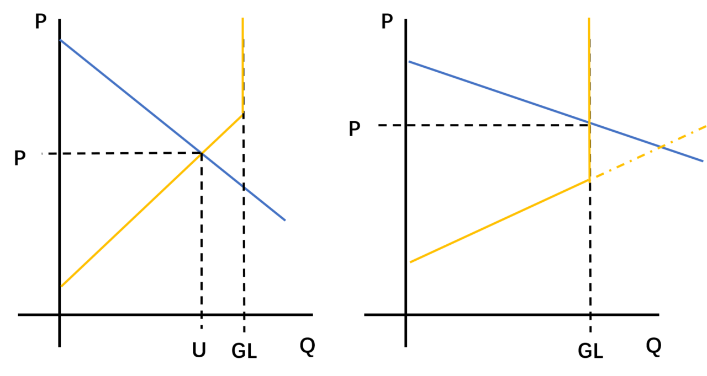
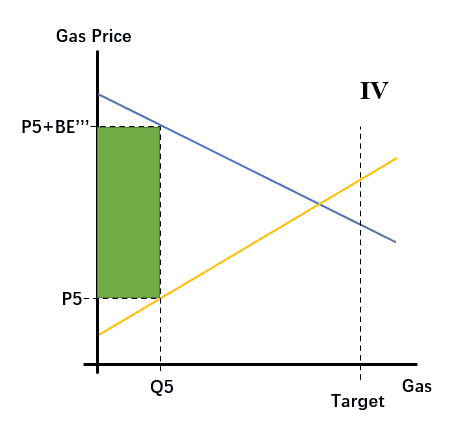
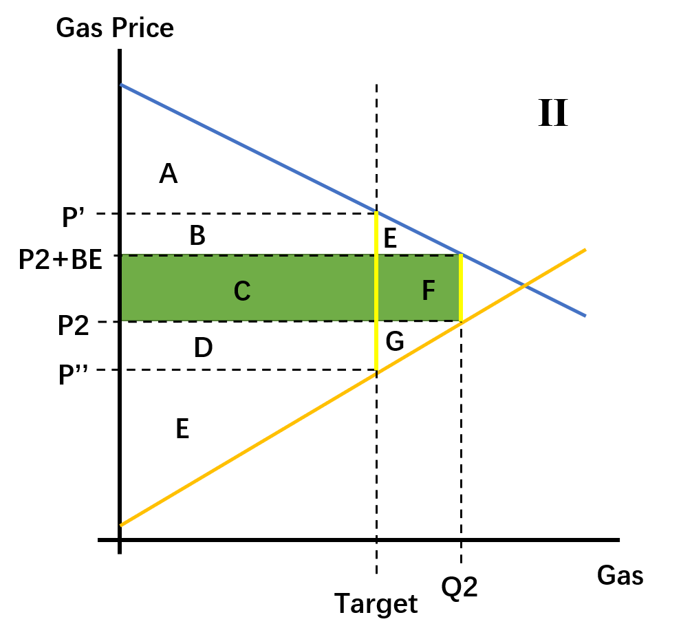

# 为什么不要 EIP-1559

> “评价政策的时候，一个最大的错误就是只讨论其初衷，不看其结果。”
>
> —— 米尔顿·弗里德曼

众所周知，EIP-1559 因其复杂性和可能造成的广泛影响，引发了许多争议。但是，支持意见已经有了[集中的表述](https://hackmd.io/@timbeiko/why-1559)（[来自 ECN 的中文译本](https://www.ethereum.cn/news/why-1559)），反对意见却缺乏合适的材料让人们了解。

有鉴于此，我准备在本文中梳理中 EIP-1559 的支持意见以及反对者提出的反驳理由。我将尽可能给出各种意见的出处，但不可避免地，因为我也是一名反对者，文章的论述顺序将以我自己的推理顺序为基础。

我希望本文既有足够的文献意义，又能让社区更多地了解反对意见（当然，我这里也不会列出所有的反对意见）。

## 一. 简介

照例，这里还是要给出 [EIP-1559](https://eips.ethereum.org/EIPS/eip-1559) 的内涵，这也将是我们下文讨论中 “EIP-1559” 一词的定义：

> （1）将区块上限增大为当前区块上限的两倍，并定义当前区块上限的值作为 “目标区块使用量”；
>
> （2）用户在发送交易时，不论给矿工支付多少，都必须支付一部分 `BASE FEE`；而 BASE FEE 会随着区块的使用率而（根据算法）自动调整：当上一（或连续多个）区块的的 Gas 使用量大于目标使用量时，BASE FEE 就提高；而如果上一（或连续多个）区块的 Gas 使用量小于目标使用量时，BASE FEE 就降低；
>
> （3）这些 BASE FEE 会燃烧掉，不会交给任何人；
>
> （4）用户在发送交易时，不再指定 `gasprice`，而是指定两个值：`FEE CAP`，表示自己愿意为每单位 gas 支付的最高代价；`INCLUSION FEE`，表示自己的交易打包上链后会支付给该块出块者的 gas 单价；只有当 `Inclusion Fee + BASE Fee < Fee Cap` 的时候，矿工才能把该笔交易打包上链。

从早期到现在，EIP-1559 支持者对这套机制的主要支持理由都是它能够改善用户发送交易时的用户体验。大略说法是：BASE FEE 的变动本身会筛选交易，使得任何时候，只要愿意支付 BASE FEE 以及一小笔打包费的人都能成功发出交易。同时，用户也无需像在当前的机制下一样，需要不断猜测合适的上链矿工费。

至于 BASE FEE 的燃烧机制，有四大支持理由：（1）防止矿工操纵整个机制（如果 BASE FEE 还是会交给挖出该块的矿工，则矿工可以自己发交易来调整区块使用量，逼迫用户支付）；（2）这样最简单，不会引起政治上的争议；（3）有利于降低 ETH 数量的通胀率，乃至让 ETH 成为一种会通缩的、“超级可靠” 的货币；（4）提高挖矿收益中区块奖励所占的比重，使挖矿算力的波动更小。

此外，另一个表面上看来与燃烧机制相关，但主要还是基于 BASE FEE 机制的主张是：EIP-1559 能防止 “经济抽象”，即保证每一笔交易都必须伴随着 ETH 的支付，维持对 ETH 的需求。

> 有关 EIP-1559 的介绍及其对用户体验的提升，见：
>
> - Eric Conner（https://medium.com/@eric.conner/fixing-the-ethereum-fee-market-eip-1559-9109f1c1814b）（[中文译本](https://mp.weixin.qq.com/s?__biz=MzU2MDE2MDU3Mg==&mid=2247490369&idx=1&sn=7b8fc29d28f280c61cbfd141bfb06ef1&chksm=fc0d1112cb7a9804ba4aca45937749249ad3eec6471c784c682e218a7122b75fc3fb73014206&scene=0&xtrack=1&key=eeca034c219d0a571f81786cf296b6dc25c46da189733244103f42e18ae1ef57984b03b067f15ebd9cd31c10d8aaf9e98b97016ccc6539ce169456504aa375cc7f70496421993b1f6dcab53727961064&ascene=1&uin=Mjc4MjA1NTcyNA%3D%3D&devicetype=Windows+10&version=62060728&lang=zh_CN&pass_ticket=pYEKfrMkmqOcF0GSjqU%2FC6jXgHE93dNtFrBLEYvkL2sL2unIvs%2Fegpn9YrOVaf%2Bi)）
> - Micah Zoltu（https://medium.com/@MicahZoltu/a-tale-of-two-pricing-schemes-dc9c8717906）
> - Tim Beiko（https://hackmd.io/@timbeiko/why-1559）（[中文译本](https://www.ethereum.cn/news/why-1559)）
>
> 有关对 BASE FEE 燃烧机制的辩护，见：
>
> - Eric Conner（同上）
> - Pintail（https://medium.com/@pintail/ethereum-fee-market-reform-eip-1559-as-a-question-of-fairness-567c52dac017）（[中文译本](https://ethfans.org/posts/ethereum-fee-market-reform-eip-1559-as-a-question-of-fairness)）
> - David Hoffman（https://bankless.substack.com/p/the-final-puzzle-piece-to-eths-monetary）
> - Hasu & Grorgios Konstantopoulos（https://insights.deribit.com/market-research/analysis-of-eip-1559/）（[中文版](https://insights.deribit.com/%e5%b8%82%e5%9c%ba%e7%a0%94%e7%a9%b6/analysis-of-eip-1559/?lang=zh-hans)）
>
> 有关 BASE FEE 带来的其它好处（主要是经济抽象），见：
>
> - Tim Beiko （同上）
> - Hasu & Grorgios Konstantopoulos （同上）
>
> 下文所引述这几位作者的观点，如无特别说明，都来自于这几篇文献。

下文我们就将一一分析支持方提出的理由。我们先处理动态调整的 BASE FEE 以及燃烧机制对以太坊的安全性造成的影响，然后再分析另一种主要观点：EIP-1559 可以提升用户的体验。其余支持和反对论点，我尽量在文章的末尾处理。

## 二. 燃烧机制相关：安全性

在与燃烧机制有关的四种支持意见中，第一种（防止矿工操纵）是站不住脚的，因为，只要一个区块 BASE FEE 不必然会交给挖出该块的矿工，矿工就没有动力去操控整个机制；并不是只有燃烧才能达成这个效果，举例而言，使用 BASE FEE 形成储备资金池来增加区块奖励，也能达成同样的抗操纵效果。虽然这种机制必然比燃烧机制更复杂，但这样做也能避免燃烧机制的许多缺点。

因此，本文将集中处理后面的两大理由（安全性以及更好的货币政策）。首先是安全性。

Hasu 和 Grorgios 提出的理由是：1559 的 BASE FEE 和燃烧机制既减少了矿工的交易费收入，又提高了区块奖励的价值，可以使以太坊网络的算力更加稳定，而不是随着交易费奖励的波动而波动。此处的假设是：挖矿算力会与挖矿收益同步波动。

但这一假设并不总是成立的。矿工增加算力时往往需要投资基础设施，包括矿场、散热、网络连接，等等，这些资本要求使他们不会因为交易费收入一时的波动就增加投入；同时，除非所挖密码学货币的价格已临近 “关机币价”（挖矿收益刚刚覆盖运营成本的底线），否则也不会轻易关机。

此外，其论述也没有讨论一种可能性，即矿工的收入在 1559 施行后变少了的可能性。

我在《[EIP-1559 只是徒劳，毫无益处](https://ethfans.org/zengmi/articles/38066)》一文中讨论了这种可能性，结论是 EIP-1559 必然会降低挖矿的收益，即，在同样的市场需求条件下，实施 EIP-1559 之后的机制，比起我们当前的机制，只能提供更少的收益，因为燃烧机制为区块奖励带来的升值，不可能覆盖其所剥夺的交易费收益；因此，实施该政策会降低以太坊区块链的长期安全性。

此处我将重复我的论证，但我会先介绍我所使用的方法的特点及其局限性，方便读者更深入地理解我的论证。

### （一）供求曲线分析的适用性

（有关供求曲线以及 “生产者剩余”、“消费者剩余” 概念的介绍，见附录 1）。

在经济学中，我们常常使用需求曲线和供给曲线来描述一种商品的价格是如何决定的。但是，供求曲线绝不仅仅是用来讲解决定价格的力量的。在经济学上，它最重要的应用是分析限制交易机会（或直接点说，限定交易双方成交价格）的机制对消费者和生产者的福利造成的影响。

其逻辑是：一组需求曲线和供给曲线就代表了一种市场情形；因此，只要我们固定这两条曲线，再通过几何上对这些限制交易机会的制度（例如：最低工资；最高火车票价；关税；从量税，等等）的表述，就可以分析出这些制度对成交价格和成交价格的影响；再加上消费者剩余和生产者剩余的概念，我们还能分析出这些制度对市场上不同群体的利益的影响。

- 图 1. 最高限价对消费者福利的影响（坐标系内所有的字母都表示离该字母最近的线所形成的几何图形） -

以图 1 所示对医疗诊断服务的最高限价为例。如果没有这样的最高限价，自由交易的市场中形成的诊金价格为 P1，诊疗服务的吞吐量为 Q1（即需求曲线和供给曲线的交点）。此时，消费者剩余为 `三角区域 A + 矩形区域 B + 三角形区域 C`；生产者剩余为 `三角形区域 D + 矩形区域 E + 三角形区域 F`。但如果实施了以 P2 为最高限价的管制，医生被禁止接受 P2 价格以上的支付，因此没有动力提供更多的服务（P2 价格线与供给曲线的交点决定了供给数量 Q2）。消费者想要竞争获得这些服务，但又不被允许提高货币支付额，于是就会形成排队的现象，再然后，如果技术允许，就会产生黄牛党（代病人排队挂号的中介）。不论如何，消费者实际支付的代价会是 P3（Q2 竖线与需求曲线的交点决定获得服务的消费者付出的实际代价），因为不付出更多的代价就无法打败其他消费者而获得这些服务，只不过这些代价不一定以货币的形式表现出来。因此，消费者剩余缩减为 `三角区域 A`，生产者剩余缩减为 `三角区域 D`，也就是双输。如果存在黄牛党，他们的收益就是 `矩形区域 B + 矩形区域 E`。但是 `三角区域 C + 三角区域 F` 所代表的利益，因为交易没发生，彻底地失去了。

所有的经济系学生在大二的时候都曾用这套方法推理过国际贸易中的关税、配额所造成的影响。对经济学家来说，使用这套方法是天经地义的，相反，不使用这套方法才需要作出额外的说明。

只不过，对经济学家以外的群体来说，他们往往难以理解的是：这套方法所使用的概念（如需求曲线和均衡），仅仅具有理论上的意义，绝不表示这些东西都是可知的 —— 意思是，绝不表示我们能找出一条函数，来描述某个人或某群人在某一时刻的消费倾向，也不表示我们总能足够迅速地捕捉到其变动，同样也没有人能告诉你，现在某个行业的市场到底均衡了没有。理解了这些，你会更明白为什么它最重要的应用就是比较不同的制度所造成的后果。—— 其论断的普遍有效性正在于它对这些概念的实证含义几乎没有任何的假设。

## （二）比较当前机制与 EIP-1559 机制

在推理中，我所使用的 “当前机制” 的定义是：（1）在任意时刻，用户发送交易时附带的手续费（其单价即 `gasprice`）都全部转移给使其交易上链的矿工；（2）在任意时刻，以太坊区块都有可使用的 Gas 数量上限，但矿工可以集体改变这个上限。

在当前机制下，只需考虑两种情形，便可涵盖市场中所有可能的情形：（1）用户对 Gas 的需求并不旺盛，使得区块不能打满；（2）用户对 Gas 的需求很旺盛，即使打满区块也达不到没有区块大小限制时候的 “自然市场均衡点”。如下图：

- 图 2. 刻画当前机制下 Gas 市场情形的两张图；左图表示区块无法打满的情形；后者表示区块空间不够用的情形 -

在实施了 EIP-1559 机制之后，则可根据自然市场均衡点是否大于目标 Gas 用量、BASE FEE 是否为零，分为五种情形：

| 编号 | 自然市场均衡点*                  | BASE FEE 状态                  | 对应现实情形                                          |
| ---- | -------------------------------- | ------------------------------ | ----------------------------------------------------- |
| I    | 大于目标 Gas 用量，小于 Gas 上限 | = 0                            | BASE FEE 为零时市场需求暴涨                           |
| II   | 大于目标 Gas 用量，小于 Gas 上限 | \> 0                           | BASE FEE 开始上升，但尚未调整到使实际用量等于目标用量 |
| III  | 大于目标 Gas 用量，小于 Gas 上限 | \> 0，且使实际用量等于目标用量 | BASE FEE 调整完成，使实际用量等于目标用量             |
| IV   | 小于目标 Gas 用量                | \> 0                           | BASE FEE 不为零时市场需求下降                         |
| V    | 小于目标 Gas 用量                | =0                             | 市场需求下降后，BASE FEE 下降为零，调整完成           |

\* 还有一种情形我在此处并未列出，就是自然市场均衡点大于 Gas 上限的情形。如许多 1559 支持者承认的，在该情形下，用户体验将与当前机制下区块被打满的时候相同。但我也同意他们所说的，这种情况也许不会持续太久。此外，比较这五种情形，也足以说明一些问题。

这五种情形及其变动过程可以用如下两个动图来可视化：

- 图 3. 给定需求曲线不变，BASE FEE 逐步增大使得 Gas 使用量最终等于目标使用量的过程。有这个效果是因为 BASE FEE 排除了那些交易剩余小于 BASE FEE 当前值的交易 -

- 图 4. 给定需求曲线不变，BASE FEE 在 Gas 使用量小于目标使用量时逐步向下调整直到等于 0 的过程。 -

有了这些直观的认识之后，只要作出以下假设，就可以让我们的推理大大推进一步：

- **假设 1**：用来比较的 “当前机制” 的区块 Gas 上限，是所比较的 “EIP-1559 机制” 的区块 Gas 上限的 1/2，且等同于 1559 机制中的 “目标 Gas 使用量”；
- **假设 2**：因为 BASE FEE 而燃烧掉的价值，将完美地转化成未来的区块奖励的增值。
- 假设 3：矿工的协调成本（以及信息成本）足够低，因此在当前机制下，如果提高区块 Gas 上限能使他们获得更高的收入，他们就会提高区块 Gas 上限。换句话说，维持一定的区块 Gas 上限，是因为该上限可以让他们获得最大的交易费收入。

使用假设 1 是为了限定用来比较的两者，使得我们的比较契合我们讨论的目的。假设 2 则完全是为了比较方便而设；使用该假设所论证出的 1559 对矿工收入的负面影响是最小的；后面我们就会看到，放弃这个完全不现实的假设，转而使用更现实的假设，将使我们得到重要的成果。

针对上述**情形 II**，我们的分析如下：

 

- 图 5. 一个<strong>情形 II</strong> 的示例。图内字母皆表示离该字母最近的线包围而成的几何图形 -

以图 5 所示市场情形为例：

- 如果不实施 EIP-1559，则矿工的供给量为 `Target`，消费者需要支付的 Gas Price 为 `P'`，消费者剩余为 `区域 A`。矿工的生产者剩余为 `区域 B + C + D + E`，其整体得益还要再加上 `区块奖励`；
- 如果实施 EIP-1559，在 BASE FEE 调整过程中出现了图 5 所示的情形，则 `区域 C + F` 即是收集起来烧掉的价值（`BASE FEE * Gas Used = Burning ether`）。此时，区块上限加大以及 BASE FEE 的综合效果是，消费者剩余扩大到了 `区域 A + B + E`。
  - 此时矿工的生产者剩余是 `区域 D + E + G`（因为所得支付水平是 P2）；根据假设二，其未来的区块奖励得益为 `区块奖励 + 区域 C + F`。因此整体得益为 `区块奖励 + 区域 C + D + E + F + G`。
- 那么矿工的得益到底是增加了还是减少了？
- 根据假设三，应该是减少了。因为，**此时在 1559 制度下的矿工得益，恰好等于以 Q2 为区块 Gas 上限的当前制度下矿工的得益**；而根据假设三，正是因为以 Target 为区块 Gas 上限能给矿工带来更大的收益，矿工才选择不把区块 Gas 上限提高到 Q2。

（有关其余情形的详细分析，可见我[之前的文章](https://ethfans.org/zengmi/articles/38066)）。

完整分析上述 5 种情形后，我们可以得到如下结论：

1. 若假设 2 为真，则**情形 III** 和**情形 V** 下，矿工的得益与的当前机制下一样（假设同等需求条件）；**情形 I** 和**情形 II**，矿工的得益减少；**情形 IV** 则难以判断，因为（我假设）矿工提高了区块 Gas 上限之后就很难降下来，因此我们不确定降低区块 Gas 上限是不是真的能带来更高的收益。
2. 假设 2 显然是不真实的，因为燃烧掉的 BASE FEE 不可能只增加未来的区块奖励的价值，相反，它会增加每一个 ETH 的价值。如果我们放弃假设 2，则可以相当有把握地说：**EIP-1559 会减少矿工的得益，因此会削弱以太坊的长期安全性**。
3. Hasu 和 Grorgios 主张 “Slack Mechanism” （可弹性增大的区块 Gas 上限）可以为用户带来更低的上链成本，这在**情形 I** 和**情形 II** 下是对的，但在**情形 IV** 下却正好反过来，BASE FEE 使得用户的上链成本比当前机制下的更高。在**情形 III** 下，用户的上链成本保持不变。（这一点在关于 DOS 界面的讨论中仍有意义）
4. 我记得有人曾向我主张，EIP-1559 可以最小化矿工的收入。很不幸地，他是对的。这套机制使得矿工不管提供多少的 Gas，在所提供的边际 Gas 上都无法享有租金，除非市场需求大到可以打满两倍大的区块。
5. 1559 的支持者强调了在市场需求高涨的时候它能带来的好处，对其在市场需求退潮的时候会造成的阻碍效果却避重就轻。

（有一个并非不重要的问题是：在 EIP-1559 实施后，矿工是否还有权力集体提高区块 Gas 上限？在当前的机制下，提高区块上限未必能给矿工带来更大的收益，所以矿工有动力维持现有的区块 Gas 上限，用户当然要为此付出更大的代价（对比 Gas 上限更大的情况），但与此同时，这也意味着区块 Gas 上限是有节制的。在 EIP-1559 实施后，矿工的收益将与区块 Gas 上限无关，仅与提供了多少 Gas 有关，如果矿工还有这样的权力，区块 Gas 上限将更无节制地增长。这个问题并不能靠禁止矿工拥有这样的权力来解决，这只不过是把一种压力换成了另一种。想到这个问题的人马上就会意识到 EIP-1559 对整个以太坊网络的运作模式改变有多大。）

## 三. 燃烧机制相关：通缩

另一种支持燃烧机制的观点是：燃烧机制将能动态地减少 ETH 的供给量，降低 ETH 的增发率，甚至让 ETH 的增发率降到零以下（也就是使 ETH 数量缩减）。（他们认为）不管怎么说，这都有助于提振 ETH 的币价（这是最让某些人兴奋的事情）。

认为数量紧缩能够提升单位货币的购买力，这不算离谱。但同样重要甚至更重要的是，**你是以什么方式实现紧缩的，这种紧缩对货币政策的影响是什么**。

当货币数量缩减不是通过我们所谓的 “自然通缩” 的过程 —— 也就是像人们弄丢了比特币钱包/以太坊钱包 —— 这样的方式来实现的，自然就有必要考虑制造通缩的机制给货币政策带来的副作用。

EIP-1559 制造通缩的代价就是：它使以太坊的货币政策不再稳定。

有人认为，比特币的货币政策成功的地方在于其有一个硬上限。这种观念是有问题的。比特币货币政策的成功不在于其有硬上限，也不在于其通胀率低，而在于其货币政策是稳定的，其通胀率在任何时刻都是可预测的。

直到今天为止，比特币仍然在不断增发，那个硬顶是没有人知道到底会不会实现的结果，但它仍然是一种更好的货币，因为其通胀率是可预测的。

当且仅当通货膨胀的幅度超出预期，它才会有我们常说的负面效果，如跨期的资源错配和过度的投资。正是因为超出了预期，市场利率才会（因为无法充分反映通胀的幅度）而低于应有的水平，才会导致储蓄不足而投资过度。当比特币以前所未有的粒度将货币增发的速度稳定了下来，它就成了更好的货币。

稳定的货币政策同样能避免所谓的 “通胀税”。因为只有货币发行不透明时，更先拿到（和知道）增发货币的人才能利用贬值之前的时间窗口把钱花出去。消除了此种信息差，也就无所谓通胀税了。

货币政策的优劣不在于其通胀率高低，而在于其是否稳定。

EIP-1559 的实施会破坏以太坊货币政策的稳定性，不仅在于其运作过程会制造无数意料之外的通缩（会对跨期的资源配置造成负面影响）；更在于，其实施本身就意味着以太坊的货币政策是可以改变的，而且可以想象，一旦实施，日后人们会围绕着算法的各种参数的调整开展政治竞争，以太坊的货币政策将永无宁日。

## 四. BASE FEE 相关：上链成本可预测性

能够提升用户上链成本的可预测性，是人们支持引入 BASE FEE 机制最主要的论点。过去，我曾经认为这一点是完全不现实的，因为人们虽然不必猜测 gas price，但还是需要猜测合适的 tip。但现在，我意识到，支持方的论证比我想象中的要复杂，必须详细说明一番。

支持方提出的一个关键论证是，BASE FEE 的运作以让区块半满为目标，因此，其运行将总是能让区块处于不满的状态（not-full block）；假使区块能打满，BASE FEE 会不断提高，直到矿工可打包的交易打不满一个区块。

在区块满载时，整个手续费市场是一个卖方市场，买方（用户）的竞争激烈程度决定了交易上链的成本，这是难以预测的；但如果区块不满，手续费市场就是一个买方市场，决定上链成本的是矿工提供 Gas 的边际成本，而不是其他用户的出价，这个是更容易预测的。

用支持方的话来说，BASE FEE 的运作使得任何人只要愿意支付 BASE FEE 以及高于矿工打包成本（也即 Gas 的边际成本）的 tip 的人都能使交易上链。

敏锐的人会意识到，这其实没有完全解决问题。因为，“tip 要高于矿工的打包成本”，可是用户哪知道矿工的打包成本是多少呀？而且显然这部分信息也不可能从 BASE FEE 当中获得。

支持方的解答有两种：

（1）存在某种可靠的方式，可以度量出矿工的边际成本 （这就是 Micah 和 Barnebe 经常提到的 `1gwei` 的由来 —— 他们按照他们认为可靠的方法，度量出来的矿工提供 gas 的边际成本就是 1 gwei ）；

（2）在 EIP-1559 实现之后，客户端为了方便挖矿，会要求打开了挖矿功能的节点设定一个 `minimun_inclusion_fee`，最低打包费用，在生产区块时，只要给出的 tip 高于这个值的，都会被打包进去，而低于这个值的就不考虑。假设矿工不会频繁调整这个值，一来二去，这部分信息就会公开，我们自然就知道了不同矿工的边际成本，用户就能愉快设定 tip 了。

—— 到此为止了。我想指出的是，说 EIP-1559 能提高用户的上链成本可预测性，这一论断的正确性，还要基于上述两种方法的可靠性 —— BASE FEE 机制本身实现的仅仅是区块不满载，没有更多了。至于这两种方法是否可靠，交给各位自己判断。

（我甚至认为，Micah 在以太坊魔术师的讨论帖中，[已经委婉地承认了](https://ethereum-magicians.org/t/eip-1559-fee-market-change-for-eth-1-0-chain/2783/266)，这些机制并不是完美的，无法保证总是能获得最优的价格，但是用户会感觉自己得到了一个公平的价格，这就是体验提升。也就是这种提升来自于一种心理上的爽感 —— 自己没有被矿工欺负。结合我们上文对燃烧机制对矿工收益影响的分析来看，这种爽感不是没有道理的 —— 矿工收入被最小化了。但是，你要不要看问题的反面呢？当需求回落的时候，矿工不会欺负用户，欺负用户的是协议本身）

另外，还有一种不需要改动协议层，但被 EIP-1559 支持者认为不够可靠的方式是：提高用户对 mempool 的可见性。

如果用户始终能获得 mempool 中待打包交易的 gas price 分布，则无论区块满不满，都可以获得很高的可预测性。比如，挖矿的节点可以公开 mempool 中下一个区块中出价最低的交易的 gas price，则用户只要出价高于此价，就能在下一个区块中打包上链。gasnow.org 就代表了这方面的一个很好的尝试。

有些人会指出，这种方式是不可靠的，因为提供这些信息的节点完全有激励把 gas price 报高一点，即使实际上区块空间并没有那么紧张。但是，这个问题也很容易解决 —— 挖矿节点并不能垄断这些信息的提供，可以让不挖矿的节点也来曝光这些信息，形成竞争。只要有多个根据 mempool 实时情况来提供 gas price 预测的服务，用户体验就能大大提升。

到底哪种方式收效更好，各位也可自行判断。

## 五. BASE FEE 相关：其它

### （一）使 DoS 成本逐步提高

在 Tim Beiko 写的 Why 1559 中，他写道，EIP-1559 使得 DoS 攻击者的成本越来越高，因为当他们开始发动攻击之后，BASE FEE 会因为区块空间较满而不断提高，进而使攻击成本不断提高。

对这个机制运作过程的描述是正确。但他并没有比较出这套机制与当前机制的安全性高低（又是一个避重就轻！）。假定当前机制的 Gas 上限恰为所实行 EIP-1559 的目标 Gas 用量，攻击者就是能用更低的成本制造更大的区块 —— 看上文的图 5 就能看出来。这跟 Hasu 所主张的  “Slack Mechanism” 含义是一致的。即使 BASE FEE 调整完成，攻击者付出的代价也不过就跟当前机制下一样高。

更荒谬的是，Tim 还说，在当前机制下，攻击者只需说服矿工让自己的交易上链即可，如果与矿工合谋，他们可以支付低于市场价格的 gas price，甚至 0 price 发动攻击。—— 对这个现象的描述是没错。但这样说能论证出什么东西呢？根本推导不出来 BASE FEE 能让以太坊网络更安全。即使没有货币支出，参与攻击的矿工的机会成本仍然是同样数量的 Gas 能为他带来的最大收益（同样是被市场价格决定的）。没有货币支出不代表没有成本啊！不论帮不帮攻击者 0 gas price 上链，同样市场条件下矿工的机会成本都没有变。要比较的是 1559 实施前后上链成本的变化，不是 ETH 支出额的变化啊！

### （二）防止经济抽象

就我理解，1559 的支持者并不是想在技术上防止经济抽象（用户无需拥有 ETH 就能使用以太坊区块链），也做不到，只是想防止经济抽象抽走对 ETH 的需求。方法就是强迫让每一笔交易都必须使用一定数量的 ETH （来缴纳 BASE FEE）。

我实在不知道这样做有什么意义。强迫并不能产生对货币的需求。强迫使用强迫得最厉害的莫过于法币，在一定司法辖区内，它拥有 “无限法定偿付权”，但这又如何？它同样不能阻止人们逃离这样的货币。

强迫使用既不是货币需求的充分条件，也不是货币需求的必要条件。

## 六. 结论

## 附录 1：供求曲线分析的基本概念

如上图，横轴为数量，纵轴为价格。

蓝色斜向下的线为**需求曲线**，表示在任一价格下，消费者愿意消费的数量；斜向下是因为，消费者会优先满足自己较为紧迫的需要，因此，额外一单位的同质物品，为消费者带来的满足必定小于上一单位，消费者对额外以单位同质物品的评价是递减的。同样地，需求曲线也可以认为是消费者的边际效用曲线。

橙色斜向上的线为**供给曲线**，表示在任一供给数量上，消费者要求的单位价格；斜向上是因为，确定了生产方法之后，生产者提供额外一单位同质商品，所需付出的代价是递增的。供给曲线可以认为是生产者的边际成本曲线（在不需要对其进行进一步的分析以解决某些特定的问题时，就可以这么认为）。

两条曲线相交的点（Q1, P1）被称为 “**均衡点**”，表示生产者愿意提供的数量恰好等于消费者愿意消费的数量，在本例中，消费者支付的价格是 P1，得到的数量是 Q1，生产者正相应。

所有消费者从交易中得到的利益，可以描述为上图中的 `三角区域 A`，（**准确定义是需求曲线以下、用户支付的实际代价线以上的几何区域**），因为在每一单位上，他们都愿意支付更高的价格，但实际上只支付了 P1，因此得到了一些好处，这被称为 “**消费者剩余**”；同理，`三角区域 B` 是所谓的 “**生产者剩余**” （**准确定义是供给曲线以上、所得实际支付水平线以下的几何区域**），因为生产者在所提供的每一单位上，都得到了超过其成本的补偿。生产者剩余有些接近于我们所谓的经营毛利润。