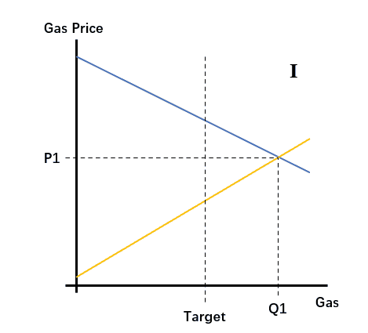

摘要：EIP -1559 的实行引发了这样一种前景：使用了 1559 的链，将无法凭借自身的成功来杀死不实施 1559 的分叉，因为其成功不会带来更高的手续费收益从而吸引矿工永久迁徙。这同样也是为什么矿工不会接受 1559，这非但不是短期的收益减少，这是永久的收益剥夺。

---

有关 EIP-1559 的争论，大家或多或少都有所耳闻。如果你了解更多，也知道我是为数不多一直反对并撰文表达自己观点的人。

在这个时间点，把 EIP-1559 当成一个政策，平静地加以讨论，或许已经不可能。在所有舆论空间里，正反双方都几乎势成水火。但是，造成这一点的原因，正在于大家并没有讨论这个政策本身，而是先有了一个成见，然后根据他人对这个成见的反应来划分好人和坏人；坏人当然不会服软，但 “我” 站在正义的一边，总有办法，总有力量，让他们服软。

举个例子，EIP-1559 是个降低 ETH 增发量乃至实现通缩的体验；通缩当然是个好事情，那反对这个事情的自然就是坏人了；或者反对者虽然不是坏人，但是你反对有什么用呢，历史潮流浩浩荡荡，你反对不仅没好处，还有点蠢；哦，不过，这个提案会烧掉原本属于矿工的手续费收入，那矿工是一定会反对的，毕竟是利益嘛；但是你们这些人，已经赚这么多了，居然不愿意舍小家为大家，可见还是不是什么好人；不过，你们又能怎么样呢，你们还能分叉吗？分叉有啥用，有 1559 的这条链，有社区的支持，肯定会更成功啊，到时候就看你们嘴上不要不要，身体诚不诚实。

我就提几个问题：

（1）通缩一定是个好事情吗？有没有什么条件？

根据货币数量论，通缩会导致货币购买力上升，这不假。问题在于，如何实现通缩的，并不是个无关紧要的问题。像 EIP-1559 提案这样的，通缩的速度并不是固定的；也就是 ETH 本身的增发率会变得不稳定；这种不稳定会为货币市场的运行带来极大的阻碍，就跟预期之外的通胀同样影响货币市场，造成投资过多而储蓄不足一样，预期之外的通缩就是反效果。换言之，一个好的货币政策应该是增发率尽可能稳定的政策。（当然欢迎反驳）

（2）减少矿工收入的提案，矿工就一定会反对吗？

我觉得如果你发起减少区块奖励的提案，一样是减少矿工的收入，但掀起的分歧肯定不会像 EIP-1559 这么大。甚至不会有什么分歧，大家直接就接受了。最多像我这样的原教旨主义者会抱怨一句，怎么 ETH 的货币政策还不稳定下来。

在讨论 1559 的时候，一个最常见的谬误就是说，“这不就是把矿工的收入减少 50% 嘛”，还真不是。这跟降低区块奖励根本就不是一回事。1559 的实质，是通过动态的运作，保证矿工在提供 gas 时，所得收益仅与自己的边际成本有关；也就是说，即使以太坊变得越来越成功，交易入块的代价会水涨船高，这些收益也跟矿工无关，全部会被烧掉。这不不仅仅是减少矿工的收入，这是剥夺矿工从以太坊的成功中获得收益的机会。

所以，这非但不像鱼池的公开声明中说的那样，只是短期的利益考量，相反，跟手续费有关的收益是最长期的，比区块奖励还要长期。

（3）矿工你们就算有这个胆，你们有能力分叉吗？你们还能不挖实施了 1559 的 ETH？

哦，这次你们对了。矿工一样会挖实施了 1559 的 ETH，肯定的，但是，他们会分叉，他们会用机枪池。

我用两幅动图来解释一下吧：

上面这幅图演示了 Base Fee 向上调整的过程。蓝色斜向下的是需求曲线，代表用户愿意为每一单位的 gas 出的最高价格，这条线的位置也代表着市场需求的旺盛程度。；橙色斜向上的是供给曲线，是矿工自己的边际成本曲线，也是他们对每一单位的 Gas 要求的最低价格。当市场需求较为旺盛，用户和矿工双方合意的打包数量超过 EIP-1559 机制定义的目标用量时，Base Fee 就会一直向上调整，调整到用户愿意发送交易的 Gas 消耗量恰好等于目标用量。

这张图可以解释很多事情，包括 EIP-1559 的支持者声称的，因为不断向上调整的 Base Fee 可以创造半满的区块，所以，决定一笔交易能否入块的价格，除了 Base Fee 之外，就是矿工的边际成本，而不是其他用户的出价。而矿工的边际成本比其他用户的出价更为稳定可预测，因此可以提升用户的使用体验。（我认同他们所说的 “半满区块” 效果，但并不觉得矿工的边际成本就很好预测，也就是我不认为这种方法真的能提供质的提升。但是，怎么说呢，其实很多支持者也并不懂这个观点是怎么证成的。）

但是，你发现没有，在整个调整过程中，矿工得到的价格，一直是绿色图形（也即是被烧掉的 ETH 数量）的下面这条边，（P2\P3\P4），而跟用户对 Gas 的评价无关。

换句话说，假设以太坊非常成功，用户愿意为单位 Gas 出的价格高一倍，矿工能不能拿到更多手续费收益？不能，因为用户的估价与矿工边际成本之间的差额会被 Base Fee 吞掉。

这意味着什么？

这意味着，如果有另一条分叉链，不实施 1559；不考虑区块奖励的区别，矿工在挖这两条链时，得到的手续费收益，可能是一样的。见下图：

在右边所示的分叉链情形中，它没有用户，所以蓝色的需求曲线非常靠左，表示用户对单位 Gas 的评价很低。但是，矿工的手续费收益，跟左边这张图（需求更旺盛的 1559 链）的收益，是一样的，是 TIP 线以下、边际成本曲线以上的这个三角形。

也就是说，假设现在有一条以太坊分叉链，有 1559 的、更多用户的这条，将无法借助自己的成功来杀死这条分叉链；因为它的成功跟矿工没有关系，不会给矿工带来压倒性的收益，所以矿工也不会放弃这条分叉链。矿工只会根据这两条链上的区块奖励价值来近乎实时地分配算力，也就是我们所知的机枪池。而每当这条分叉链上的用户增加一分，两条链的优势对比就会逆转一分。

我不会否认，很可能这条有 1559 的链，会有更高的币价，毕竟，分叉链上的密码学货币可能会被砸盘。

但是，扪心自问，这样对以太坊来说，又有什么好处呢？一群人，信誓旦旦地说 EIP-1559 会带来更高的安全性，可以平抑以太坊挖矿算力的波动，结果是以太坊可能陷入更大的算力波动中。这就是致命的自负带来的意料之外的结果。

我们常说矿工的收益决定了一条链的安全性，但却自相矛盾地去支持一种将矿工永远限于只能以区块奖励为主要收入的政策。同样地，以太坊的用户也浑然不觉，自己悄悄地就被剥夺了通过出更高的价格来购买更多安全性的权利。在一条实施 1559 的链上，用户发送交易时候的代价仍然能决定自己的交易在区块中靠前还是靠后，但是，这个代价没法买来安全性了。

（“我怎么知道你说的是对的？”“运用自己的理性。”）

最后，以太坊会分叉吗？

就我所知，批评 1559 的人，没有一个真心诚意希望以太坊分叉，没有人真觉得战争是一件好事情，没有人喜欢整个生态陷入混乱。相反，支持 1559 的人，更多把分叉挂在嘴边，颇有些 “谅你也不敢” 的意味。

从我个人的角度，我不知道该如何才能消弭这种气氛，弥漫在以太坊社区的气氛：一方面认定矿工是一群只图自己快活，不管他人遭遇的不道德之人；另一方面，相信社会运行的最终结果纯粹是由力量决定的，所以只要有某个人、某个团体足够有力量，就能制服这群不道德之人，迫使他们屈服、让步。

我在此不再讨论矿工是不是该为很多用户体验上的问题负责任。我讨论后者：一个社会的运作，真的是由力量决定的吗？或者说，有力量的，就可以为所欲为吗？再或者，力量加上智慧，就能改造社会，使之进步吗？我的答案是否定的。

从社会科学，尤其是经济学中，我们得到的最重要教训就是，我们不可能随自己的心意改变社会的机制还不引起糟糕的后果。就好像计划经济无法实行，并不是因为大家道德水平不够高，而是因为其缺乏足够的信息来做出合理的决策。

没有哪个团体、哪个人是错误政策的敌人，消灭他们并不会让事情变得更好；错误政策真正的敌人是经济规律。

但是，说这些话，可能也没啥用。以太坊仍有可能陷入分叉，因为人们不愿意放弃一个看起来很美好的政策，更不愿意放弃对另一个团体的成见。

我说这些，只不过想让大家知道：1. 这不是短期的事，也不是仅跟利益有关；这事关忠诚，如果实施，以太坊的矿工不会再对以太坊有半分忠诚；这事关宽容，你是否愿意接纳社会中存在另一群你并不理解，但为他人提供了服务的人。我知道有些人不在乎这种忠诚，但我希望有人在乎。2. 在你讨论政策，表示支持的时候，请尽量保持清醒，为你自己，也为他人，负起责任。雅典的僭越者（破坏城邦民主的暴君），没有一个不是打着漂亮的旗号上台的。